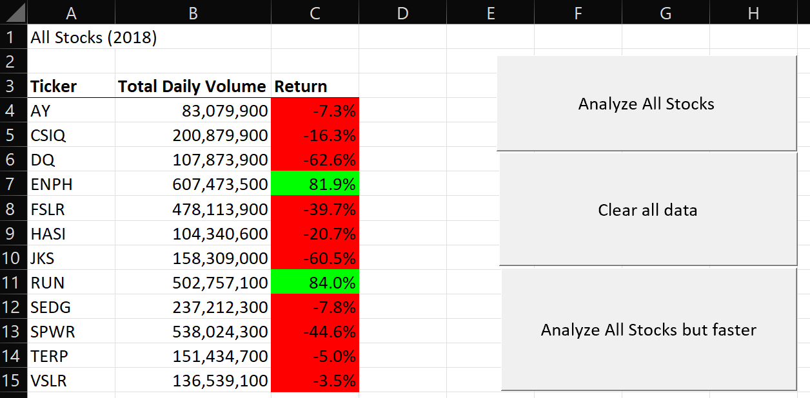

### VBA Challenge

## Background
Stakeholder interests are to perform an analysis on thousands of stocks over multiple years using Excel and VBA.

## Overview of Project

The project challenge is to apply code that organizes, calculates, and formats information. We used for loops and if-then statements to create arrays that store values. This allowed the user to loop information into categories and to further format numbers with different colors. VBA allows a user to write a complicated script that performs complex analyses, which cannot only be done on Excel.

pic here of the code

### Purpose

The purpose of this challenge is to create a VBA macro that can trigger pop-ups and inputs, read and change cells values, and format cells, using for loops, nested for loops, and conditionals to direct logic flow. 

## Analysis and Challenges

The biggest challenge was debugging syntax errors or array errors, remembering my syntax, and diagnosing the problem with the code when running into errors. 

## Results

The initial code loops over the entire year's worth of stock data for each stock of interest. This code needed 12 different iterations over a whole year's data. The results of two years that are analyzed is shown below:

The refractored code looped over all the data for a given year only once while still saving all the values needed to update the table.

The percent decrease in runtime is calculated below as (2017 data):

Overall decrease = original time - new time

## Summary

- What are the advantages or disadvantages of refactoring code?

- How do these pros and cons apply to refactoring the original VBA script?
